# 최적화 알고리즘을 이용한 회귀식 추정 
---
## 회귀식 추정
### 1.파이썬

- 서울시 코로나19 백신 예방접종 현황을 이용하여 그래프를 그려보았다. 
- 선형 그래프를 그리는데에 어려움을 느껴 다른 방법을 찾아봤다.

### 2. 엑셀

- 엑셀 기능의 데이터 분석을 통하여 회귀식 추정을 해 보았다.
- 해당 요약을 통하여 얻은 정보는 Y=24573x+190832 이다.
- 데이터 값으로 얻어진 그래프와 일차 그래프를 비교하여 보았다.
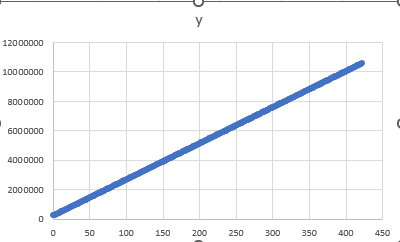
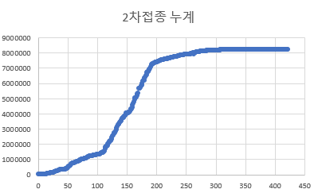

- 그래프가 알맞게 그려졌다고 보인다.
- 이제 이 식을 이용하여 에러를 최소화하는 모수 값을 
- 최적화 알고리즘(모의 담금질 기법)을 이용하여 추정해보려고 한다.
---
## 최적화 알고리즘(모의 담금질)

### 1. 소스코드
### (우선 Y=X^2 으로 진행하여 보았다.)
- 구현은 google colab을 이용하여 파이썬의 numpy를 사용하였다.
- [해당 링크](https://colab.research.google.com/drive/1GNGyDW64OTSMenQ6VGeKqi8qX2wtDqP3?usp=sharing)에 코드를 공유해 두었다.

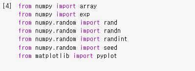
- google colab을 사용하면 별도의 조치 없이 자동으로 numpy를 이용 할 수 있다는 좋은 사실을 알게되었다.

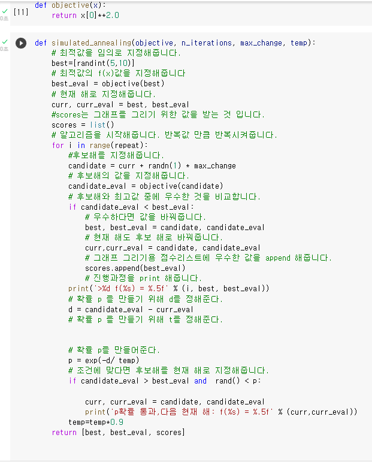
- 모의 담금질 기법을 구현하여 보았다. 
- 최적해와 상당히 차이나는 임의의 x와 y를 randint로 지정해준다. 
- 이 값들을 일단 현재 해로 지정을 해준다.
- **후보해를 지정할 때 [이웃해의 범위]로 현재 해에서 평균0,표준편차1의 가우시안 표준정규분포 난수를 max change값(0.1) 이상이 넘지 않게 더해준다. 값은 더해질 수도, 빼질 수도 있다.**
- 해가 더 우수하지 않더라도 0~1사이에 랜덤한 수 보다 
- 확률 p = e-d/T 보다 작으면, 현재 해가 될 기회를 준다.
- 확률 p에서의 T(temp)가 점점 낮아져야 하기에, temp=temp*0.95를 작성하여 주었다. 
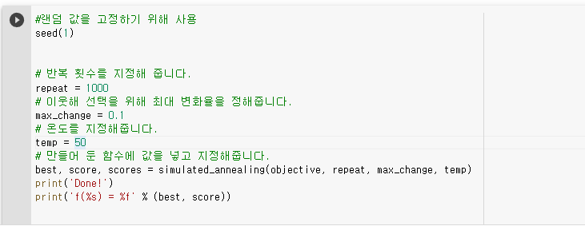  
- 적당한 반복횟수와 이웃해 선택을 위한 최대 변화율,그리고 온도를 지정해 두었다. 

### 2. 실행 후 출력값
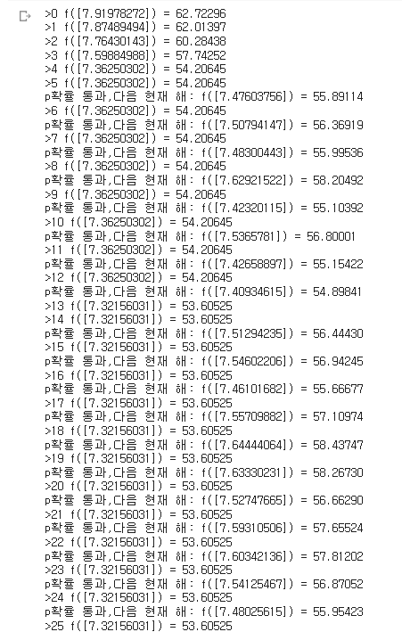
- **다음 해 라는 것이 출력되면 확률 p가 랜덤확률보다 높아서 f(x)가 최적해와 멀어져도 이웃해가 다음 현재 해가 되는 것을 의미한다.**

- 처음에는 T의 값이 크다보니 이웃해가 다음 현재 해가 되는 확률이 높다는 것을 알 수 있다.
 
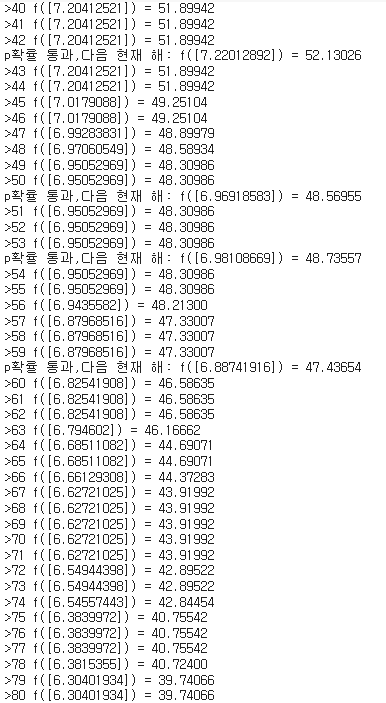
- 하지만 시간이 갈 수록 확률 p 가 낮아지는 것을 볼 수 있고, 최적해를 찾아가는 것을 볼 수 있다.
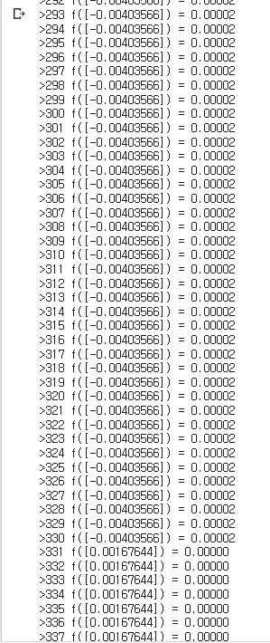
- 상기한 조건값을 이용하였을 때, $Y=X^2$그래프는 약 330회 만에 최적값을 찾는다는 것을 볼 수 있다.
- 해당 그래프의 최솟값은 0이므로, 모수 값 추정이 잘 작동한다는 것을 알 수 있다.
  
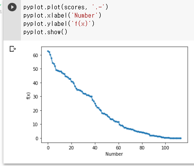
- 상기한 코드의 scores를 이용하여 보기 편하게 그래프를 작성하여 보았다.
- 해당 방식으로 최적해를 찾아간다는 것을 볼 수 있다.

---
## 회귀식 추정 한 값을 이용한 최적화 알고리즘 적용
#### 위에서 구한 y=24573x+190832에 최적화 알고리즘을 적용해보도록 하였다.
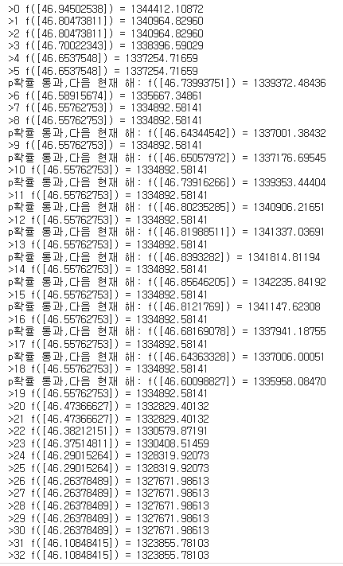
- 한번도 확률을 통과하지 못하여서 오류인가 생각하였는데, 온도를50에서 10000까지 올려야 겨우 확률이 통과하기 시작하였다. 
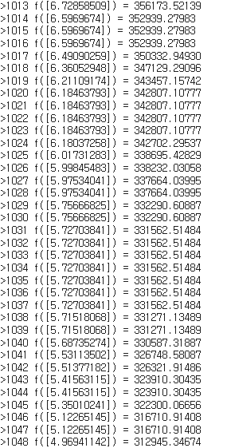
- 약 1000번을 시행하였고, 에러없이 계속 최적해를 찾아 나가는 모습을 볼 수 있다.
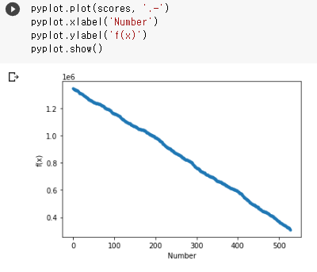
- 최적화 되어가는 그래프를 보았을 때도, 자연스럽게 최적해를 찾아가는 모습을 볼 수 있다.

# 정리
모의 담금질 기법은 온도가 높을수록 예외가 잘 발생한다.
1차 방정식이 2차방정식보다 훨씬 예외가 적게 발생한다.

# 소감
- 이번 기말 과제를 통하여 평소 즐겨쓰던 파이썬을 이용하여 머신러닝의 기초를 배우게 되었다.
- 앞으로 내 진로가 어느 방향이 될 지는 모르겠지만, 이번 경험을 통하여 식견이 넓어져서 좀 더 윤택한 삶에 한발짝 다가갈 수 있었으면 좋겠다.

# 참고
http://taewan.kim/post/numpy_cheat_sheet/ (numpy 기초)
https://nittaku.tistory.com/443(python random모듈 정리)
https://loadtoexcelmaster.tistory.com/entry/%EC%97%91%EC%85%80%EC%97%90%EC%84%9C-%EC%84%A0%ED%98%95%ED%9A%8C%EA%B7%80%EB%B6%84%EC%84%9DSimple-Linear-Regression-%ED%95%98%EA%B8%B0 (엑셀 회귀 분석)